<div align="center">

# ✦ AgentGlass

### A glass box for your AI agents.

**Capture, inspect, replay, and analyze every agent run — no SDK, no code changes.**
Point your agent's base URL at AgentGlass and see every LLM call, tool
invocation, token, and dollar it spends. Live, on your own machine.


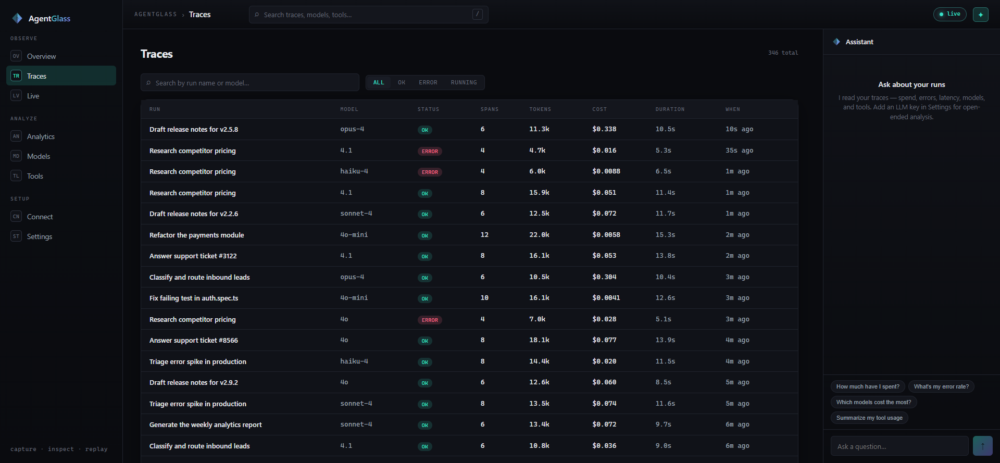

</div>

---

## Why AgentGlass exists

Your agent just made 14 LLM calls, invoked 6 tools, burned 180k tokens, and cost
you \$2.30 — and you have **no idea** what happened inside. Which step blew the
context window? Which tool call failed and got silently retried? Which model ate
your budget? Modern AI agents are **black boxes**: you see the final answer, not
the messy, expensive path they took to get there.

**AgentGlass makes them glass.** It sits transparently between your agent and the
model provider (Anthropic or OpenAI), records everything that flows through, and
turns it into a dashboard you can actually read — trace by trace, span by span,
token by token, dollar by dollar.

- 🛰️ **No instrumentation.** No SDK to install, no wrapper to import. Set one
  environment variable and you're capturing. Works with Claude Code, the OpenAI
  SDK, LangChain — anything that speaks the Anthropic or OpenAI wire format.
- 🔒 **Local-first.** Everything runs on your machine and stays there. One
  process, one SQLite file, no cloud, no account, no telemetry.
- 🧱 **No native modules.** Built on Node's built-in `node:sqlite` — nothing to
  compile, installs clean on every platform.
- 🎛️ **Reads like an instrument.** A dense, dark, purpose-built console:
  tool-call waterfalls, per-step token & cost meters, a context-window chart,
  run diffs, spend analytics, and an assistant that answers questions about your
  runs.

```
   your agent  ──▶  AgentGlass  ──▶  Anthropic / OpenAI
                        │
                        ▼
                 records + streams
                        │
                        ▼
                 📊 the dashboard
```

## Quickstart

```bash
git clone https://github.com/vugarfamiloglu/agentglass.git
cd agentglass
npm install && npm --prefix web install
npm run dev
```

Open **http://localhost:4318** — the dashboard is live with a week of **simulated**
agent runs, so you can explore every screen immediately without wiring anything up.
Then point a real agent at it:

```bash
# Claude / Anthropic SDK
export ANTHROPIC_BASE_URL=http://localhost:4319

# OpenAI SDK
export OPENAI_BASE_URL=http://localhost:4319/v1
```

Run your agent as usual — every call now shows up in AgentGlass.

> **Prefer one command?** `docker run -p 4319:4319 agentglass` (see
> [Docker](#docker)) serves the whole thing — dashboard, API, and proxy — on
> port `4319`.

---

## A tour of every screen

AgentGlass is organized into three groups in the left rail — **Observe** (what's
happening), **Analyze** (what it cost and how it behaved), and **Setup** (how to
connect and configure). Here's what each screen is for.

### Overview — the command center


The landing page answers "how are my agents doing right now?" at a glance. Six
**stat cards** show total runs, all-time spend, tokens used (and how many were
served from cache), tool calls, error rate, and average latency. Below them, a
**spend chart** plots hourly cost over the last day, and a **recent runs** table
lists the latest agent runs with their model, status, tokens, cost, and age —
updating **live** as new runs stream in. On the right sits the **assistant**
(more on that below), always a question away.

### Live — watch runs arrive

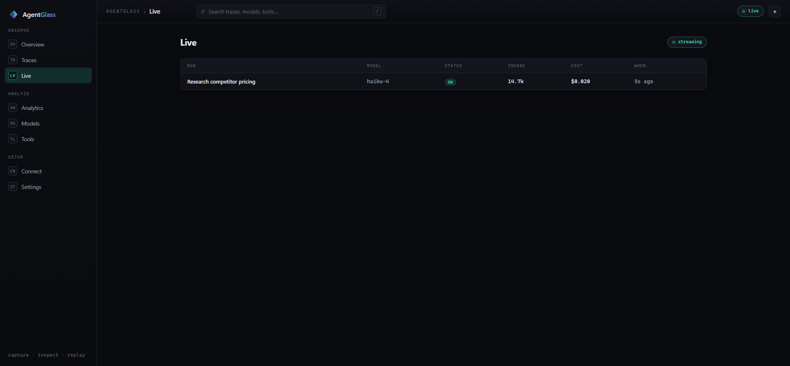

A real-time feed of runs the instant they start. Backed by a WebSocket stream, it
shows in-flight runs (status `RUNNING`) turning into `OK` or `ERROR` as they
finish, with tokens and cost ticking up. This is the screen you leave open on a
second monitor while your agents work.

### Traces — every run, searchable

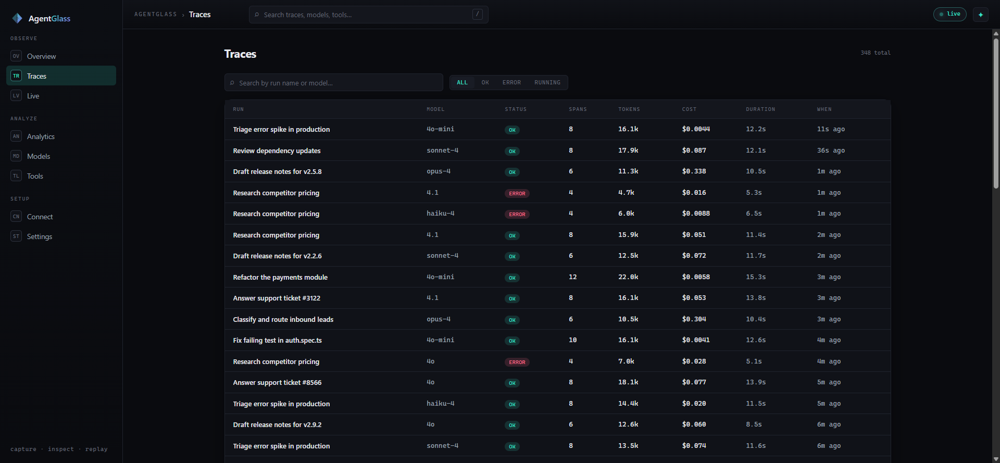

The complete, filterable log of every agent run. Search by run name or model,
filter by status (`all` / `ok` / `error` / `running`), and page through the
history. Each row is one agent run — its span count, total tokens, cost,
duration, and when it happened. Click any row to open the **inspector**.

### Run inspector — open the black box

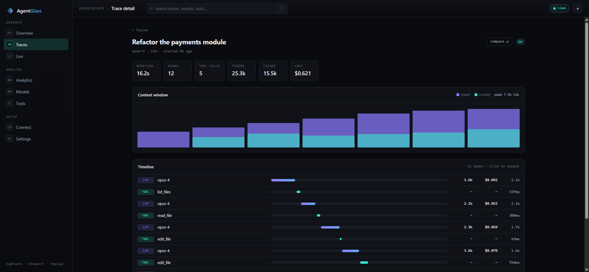

This is the heart of AgentGlass. Open a single run and see exactly what happened
inside:

- **Summary chips** — duration, span count, tool calls, tokens, cached tokens,
  and total cost for the whole run.
- **Context window chart** — a stacked bar per LLM call showing how the input
  context *grows* call-by-call (violet = fresh input, cyan = cached). This is how
  you spot the step that blew your context budget.
- **Timeline waterfall** — every span (LLM call, tool execution, event) as a
  time-positioned bar, colored by type, so you can see the agent's
  `plan → tool → observe → act` loop unfold. Each row shows that step's tokens,
  cost, and latency.
- **Click any span** to expand its full input and output JSON, model, and exact
  token/cost breakdown.

### Run diff — compare two runs

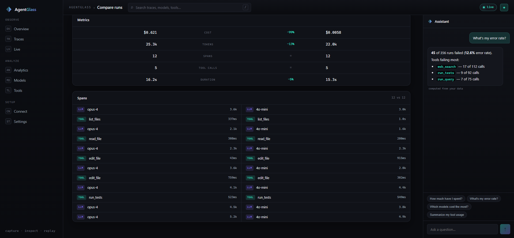

Pick any two runs and compare them side by side. The **metrics** rows show cost,
tokens, spans, tool calls, and duration for each, with a colored delta (cyan =
better, rose = worse) — so you can answer "was opus actually worth 100× the cost
of mini here?" at a glance. Below, the two runs' span sequences sit column by
column.

### Analytics — spend, patterns, and breakdowns

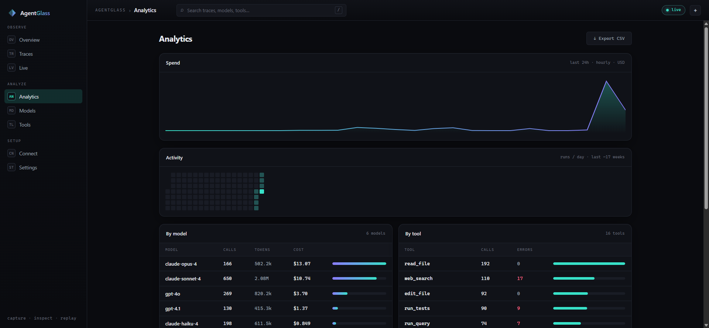

The big-picture view. A **spend chart** over time, a GitHub-style **activity
heatmap** (runs per day), and two breakdown tables: **by model** (cost, calls,
and tokens per model, with proportional bars) and **by tool** (call counts and
failure counts per tool). One click **exports every trace to CSV** for your own
analysis.

### Models & Tools — per-entity detail

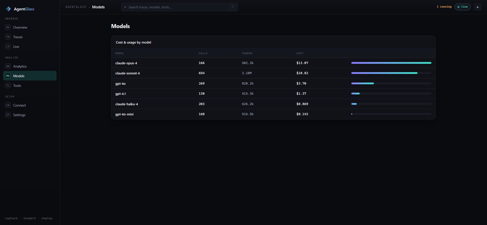

Dedicated pages that zoom into a single dimension. **Models** ranks every model
by cost with its call count and token usage; **Tools** ranks every tool by how
often it's called and how often it fails — the fastest way to find the flaky tool
that's quietly costing you retries.

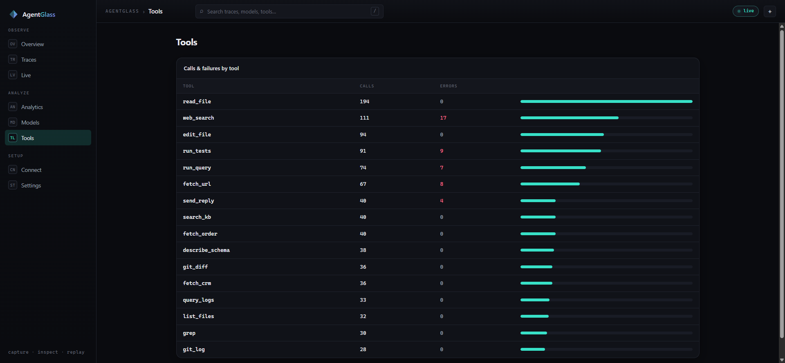

### Connect — point your agent here

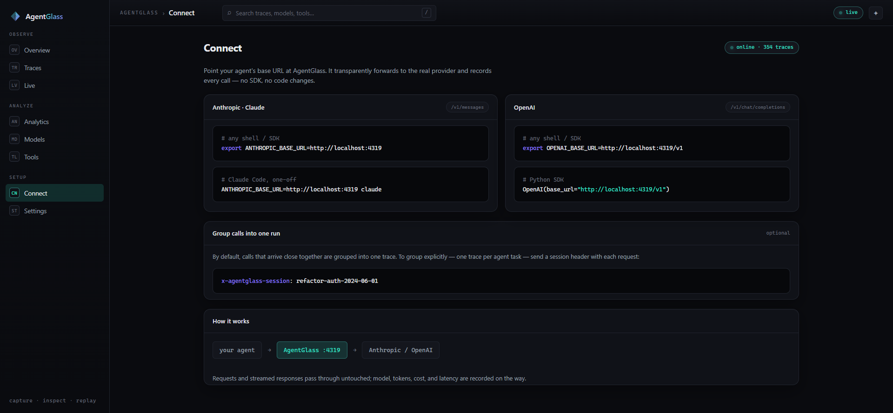

Copy-paste setup for the recording proxy. It shows the exact `ANTHROPIC_BASE_URL`
/ `OPENAI_BASE_URL` values, an optional `x-agentglass-session` header for grouping
a task's calls into one trace, and a diagram of how requests flow through
AgentGlass to the real provider and back — untouched.

### Settings — the assistant key, sealed

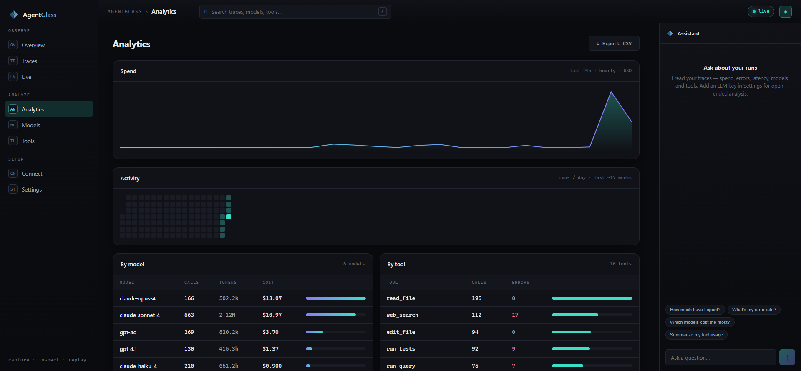

The assistant answers questions about your runs locally with **no key at all**.
Add an Anthropic or OpenAI key here to unlock open-ended analysis — it's sealed
with **AES-256-GCM** in `data/.vault-key` and never leaves your machine. The key
field has a show/hide toggle, and you can remove the key at any time to fall back
to local answers.

### Assistant — ask your runs

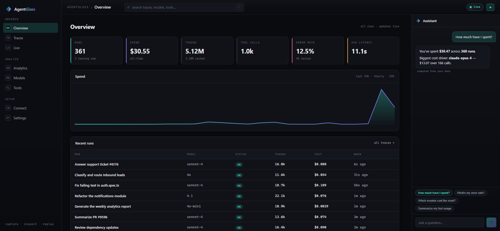

The right-hand rail (toggle it with the ✦ in the top bar) is a chat that
**reads your traces**. Ask "how much have I spent?", "what's my error rate?",
"which models cost the most?", or "summarize my tool usage" and it answers
instantly by computing over your data — no API key required. On a specific run's
page it can answer about *that* run ("why did this cost so much?"). Add an LLM key
in Settings and open-ended questions get routed to the model, with your run
context attached.

---

## How the recording proxy works

AgentGlass exposes two endpoints that mirror the providers' own:

| Endpoint | Mirrors | Set |
|----------|---------|-----|
| `POST /v1/messages` | Anthropic Messages API | `ANTHROPIC_BASE_URL=http://localhost:4319` |
| `POST /v1/chat/completions` | OpenAI Chat Completions | `OPENAI_BASE_URL=http://localhost:4319/v1` |

When your agent calls one of these, AgentGlass **forwards the request to the real
provider** (preserving streaming via a stream tee), reads the token usage from the
JSON or SSE response, prices it, and records it as a span — then returns the
provider's response to your agent **completely untouched**. Recording is fully
guarded: a bug in AgentGlass can never change or break the response your agent
receives.

Successive calls are grouped into a single **trace** (one agent task) either by an
explicit `x-agentglass-session` header or by a short idle window, so a multi-step
agent run shows up as one coherent tree instead of scattered calls.

## Features

| | |
|---|---|
| 🛰️ **Recording proxy** | Anthropic- & OpenAI-compatible endpoints that transparently forward and record — streaming preserved. |
| 🌲 **Trace explorer** | Every run as a tree of spans: LLM calls, tool executions, events. |
| 🔬 **Run inspector** | Waterfall timeline, context-window chart, per-step token & cost, full I/O. |
| 💸 **Token & cost accounting** | Per-step and per-run input / output / cache tokens and USD, rolled up automatically. |
| ⚡ **Live stream** | Runs light up in the dashboard as they happen, over WebSocket. |
| 🔀 **Run diff** | Compare two runs side by side — cost, tokens, latency, spans. |
| 📈 **Analytics** | Spend over time, activity heatmap, breakdowns by model and tool, CSV export. |
| 🤖 **Ask-your-runs assistant** | Answers about your traces locally; optional LLM for open-ended questions. |
| 🔒 **Local & sealed** | Runs on your machine; the one secret (assistant key) is AES-256-GCM vaulted. |

## 🛠 Tech Stack

| Layer | Technology |
|-------|-----------|
|  | Server runtime — one process serves API, WebSocket, proxy, and UI |
|  | Tiny, fast HTTP + WebSocket framework |
|  | Built-in trace store (WAL) — no native modules |
|  | Dashboard SPA |
|  | Frontend build + dev server |
|  | End to end |

All charts and visualizations are hand-rolled SVG — no charting library.

## Architecture

```
agentglass/
  src/                server (Node + Hono + node:sqlite)
    index.ts            entry — API + WebSocket + proxy + SPA hosting
    proxy.ts            the recording proxy (Anthropic + OpenAI)
    db.ts               trace store (traces → spans, WAL, rollups)
    sim.ts              simulator — a week of realistic runs, streamed live
    assistant.ts        ask-your-runs (local answers + optional LLM)
    vault.ts            AES-256-GCM key sealing
    pricing.ts          per-model token pricing
    hub.ts / api.ts     live event fan-out / REST surface
  web/                dashboard (Vite + React 19 + TypeScript)
    src/pages/          Overview, Traces, TraceDetail, Diff, Analytics, …
    src/components/     hand-rolled SVG charts, the assistant rail, …
  docs/screenshots/   the images in this README
```

## Docker

```bash
docker build -t agentglass .
docker run -p 4319:4319 -v agentglass-data:/app/data agentglass
```

Open **http://localhost:4319**. The container serves the built dashboard, the API,
the WebSocket stream, and the recording proxy — all on one port.

## Configuration

| Env | Default | Purpose |
|-----|---------|---------|
| `AGENTGLASS_PORT` | `4319` | Dashboard / API / proxy port |
| `AGENTGLASS_DATA` | `data` | SQLite store + vault key directory |
| `AGENTGLASS_SIMULATE` | `1` | Seed & stream simulated runs (set `0` to disable) |
| `ANTHROPIC_API_URL` | `https://api.anthropic.com` | Upstream to forward Anthropic calls to |
| `OPENAI_API_URL` | `https://api.openai.com` | Upstream to forward OpenAI calls to |

Turn the simulator off (`AGENTGLASS_SIMULATE=0`) once you're feeding it real runs.

## Development

```bash
npm run dev          # server (:4319) + Vite dev server (:4318) together
npm run typecheck    # type-check server and web
npm test             # run the test suite
npm run build        # build the SPA + compile the server to dist/
npm start            # run the production build
```

## License

[Apache-2.0](LICENSE)
